# Cryptocurrencies
## Purpose
The purpose of this project is the create a report for an investment bank interested in offering a new cryptocurrency investment portfolio using python's sklearn and unsupervised machine learning.
## Deliverable 1
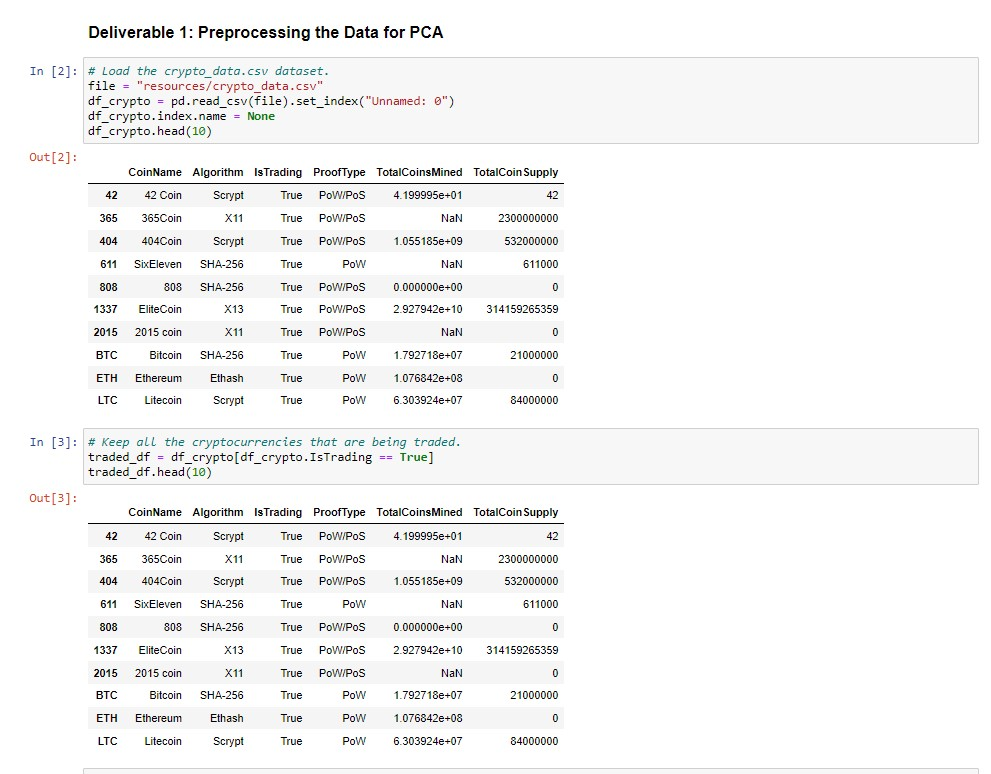
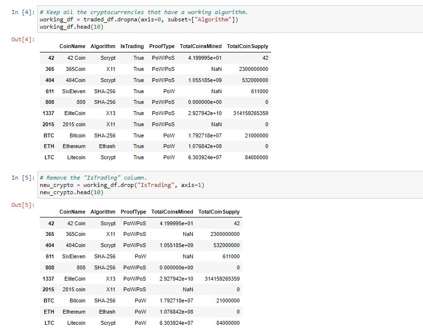
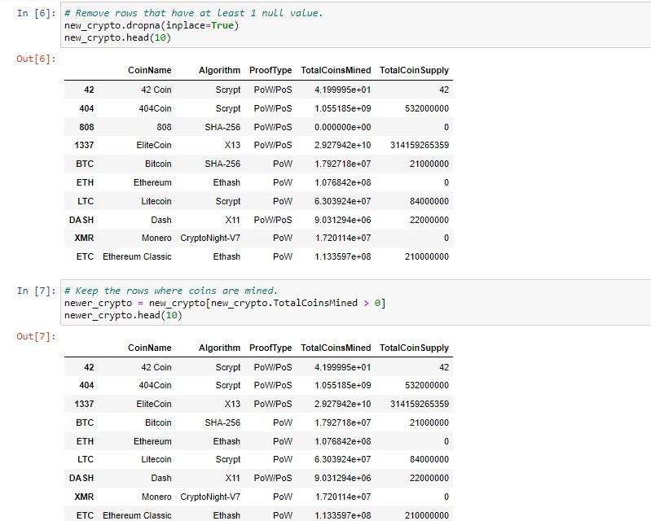
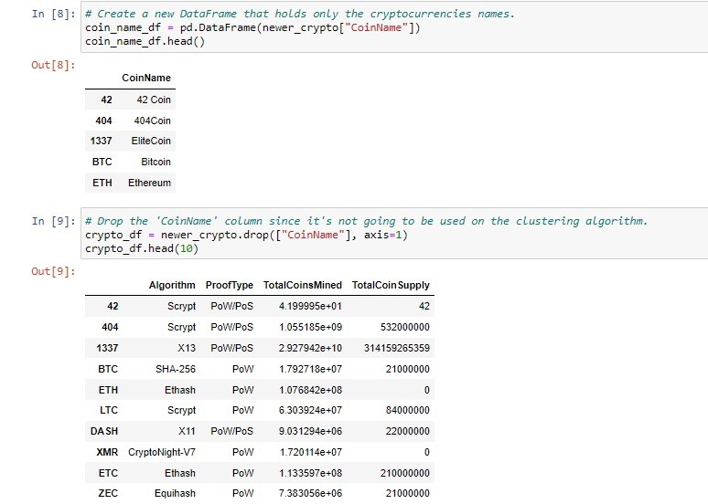
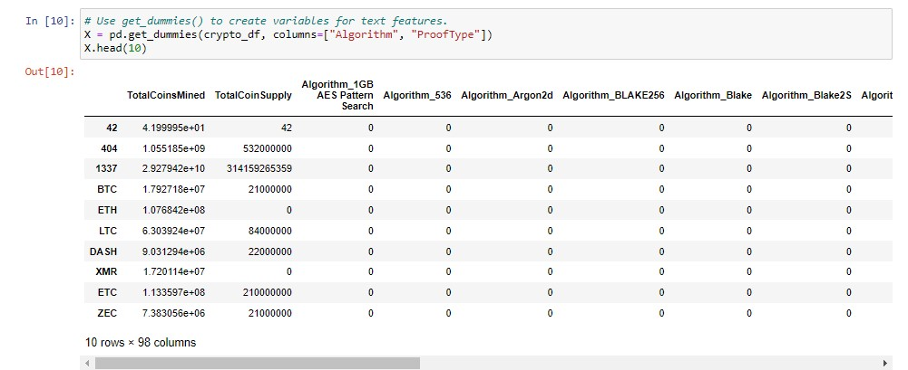
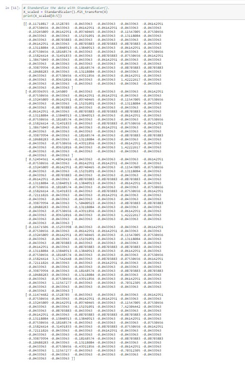

## Deliverable 2
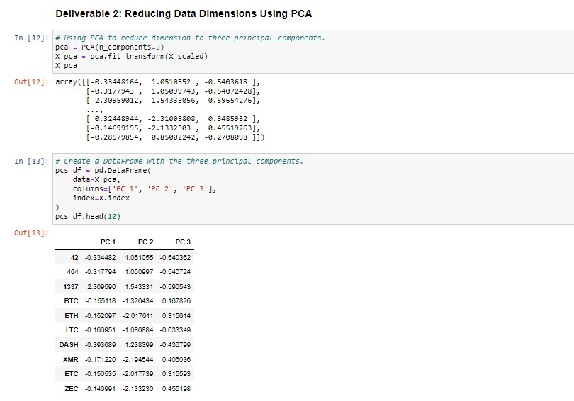

## Deliverable 3
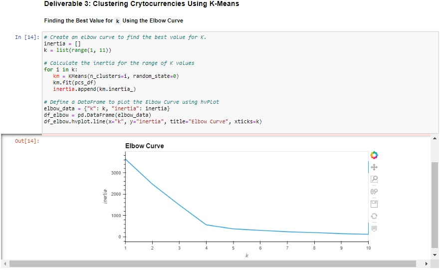
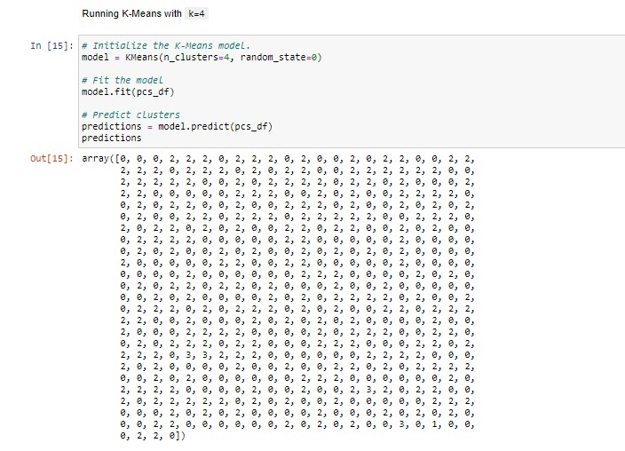
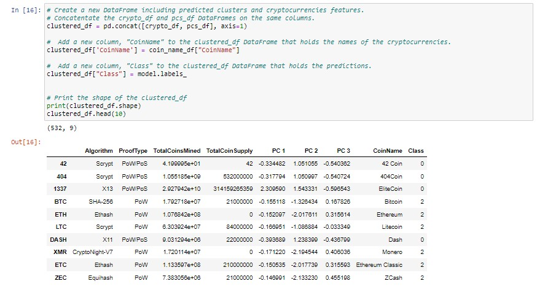

## Deliverable 4
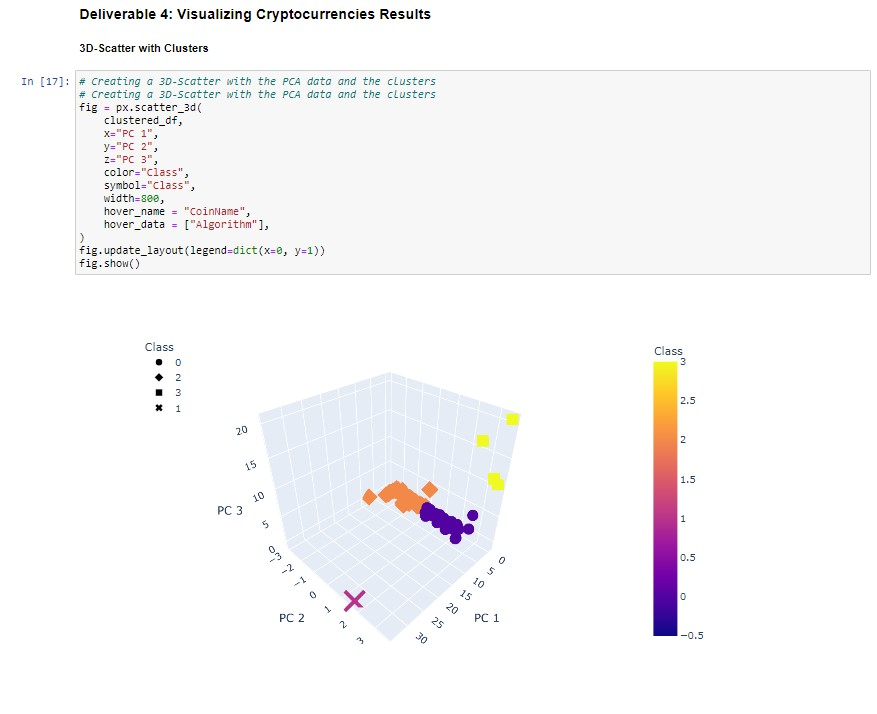
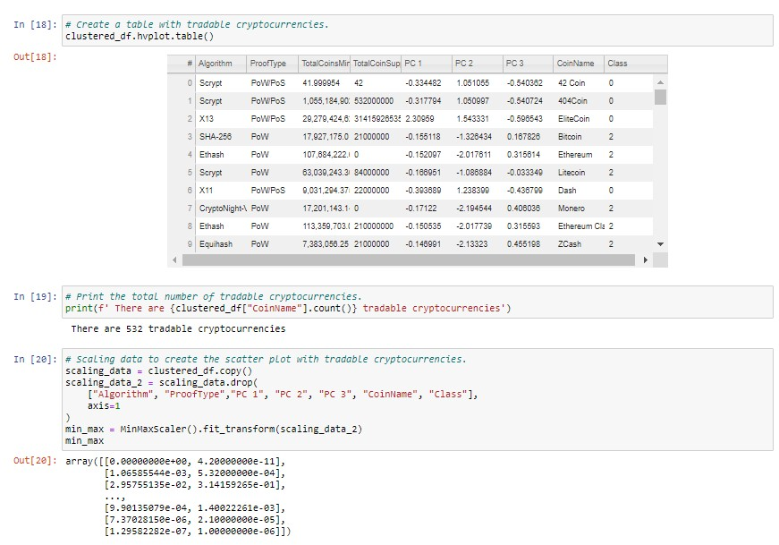
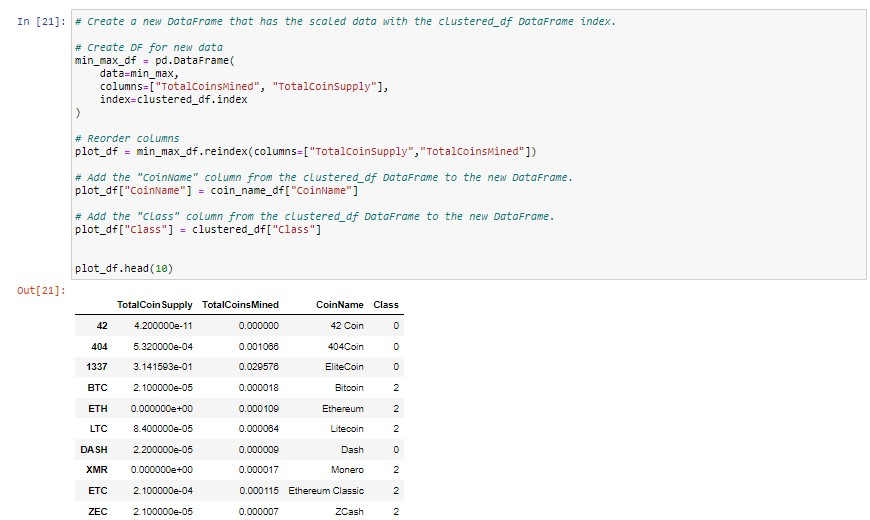
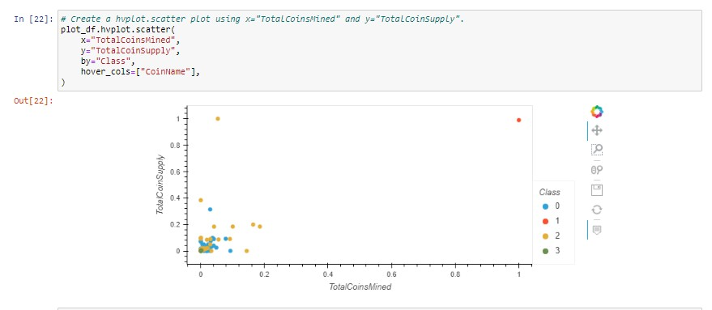

## Summary

From the three-dimensional graph, one can see that there are four distinct groups. Class “0” and “2” groups are clustered together with most cryptocurrencies falling into one of these two groups. The class “3” group has three different cryptocurrencies that are farther away from the others and there is a class “1” point that only has one cryptocurrency. This visualization shows there are lot of cryptocurrencies that perform similarly while there are few outliers. To complete a more in-depth analysis on these cryptocurrencies, one would have to look at their historical pricing to understand the performance of each of these currencies. This would help investors now how stable or risky their investment would be based on the different cryptocurrencies they invest in.
